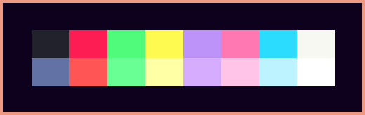
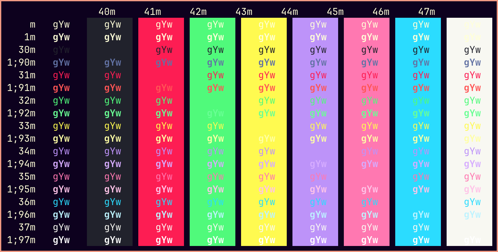

# Midnight City Ghostty
The Midnight City color scheme for Ghostty.

 

* [Ghostty for macOS and Linux](https://ghostty.org/)

* [Midnight City for VS Code](https://github.com/dillonchanis/theme-midnight-city/tree/master) 

Place file in ~/.config/ghostty/themes/ (create folders if non-existing).

*Midnight City*

 

